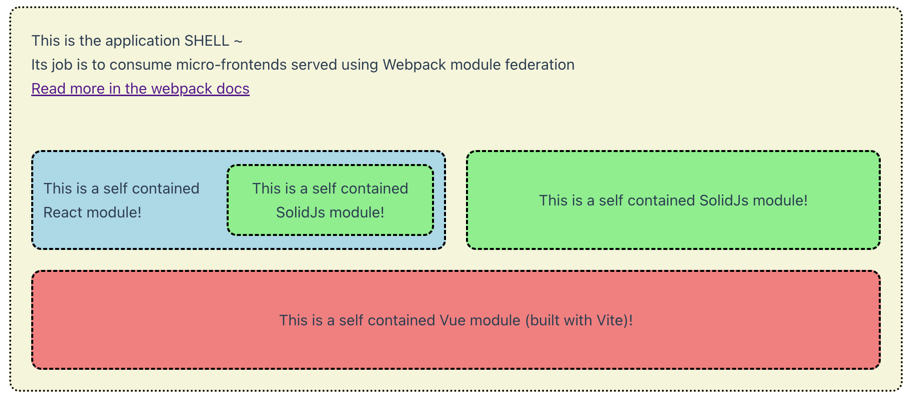

# Micro frontends with module federation

Experimenting with creating framework agnostic microfrontends using Webpack5 & Vite module federation.
Using Nx for application/package coordination.

https://webpack.js.org/concepts/module-federation/
https://github.com/originjs/vite-plugin-federation

Below is a screenshot of all frontends running.
The wrapping beige square is the shell-application exclusively hosting remotes.
But as displayed in the picture a remote can also consume other remote containers.
The green square (a SolidJS app) is being consumed by two separate hosts.

Modules are hotswapped when any change is made to the application code.

## Scripts

To start all applications from the root run `npm run start-all`.
This will start up the host application and all remotes on `localhost:3005`.
